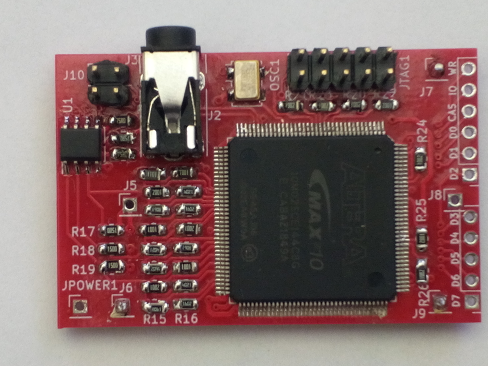
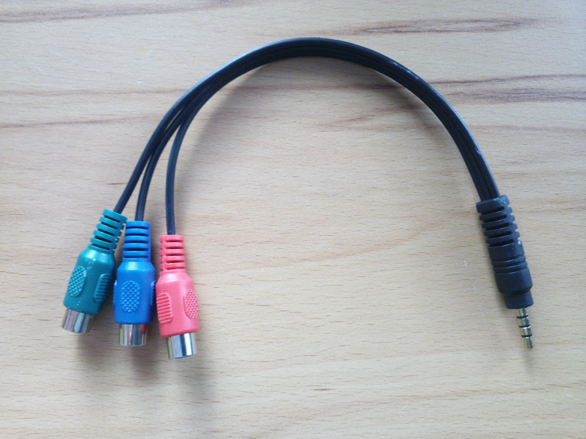
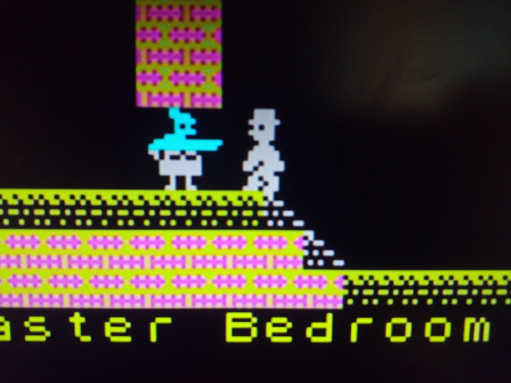

# ZX-Spectrum-Component-Video
Component video (YPbPr) output for the ZX Spectrum computer 

## Objective

This hardware modification is a more compact version of the solution that uses an A-Video board with seperate level shifters.
It tries to solve various shortcomings of https://github.com/c0pperdragon/A-VideoBoard/tree/master/zxspectrummod :

- Smaller and cheaper to make
- No need to modify the case of the ZX Spectrum
- No need to remove any components besides the RF modulator.

## Video output possibilities

- 288p (default) or 576p
- YPbPr (default) or RGsB

Output modes can be selected by jumpers or optional switches.

## Drawbacks

Installation of the mod requires complete removal of the RF modulator. This also implies that an
existing composite video mod will no longer be available. Without further modification the 
ZX Spectrum will then work with component video output exclusively.

If you need composite video additionally you can wire up an extra connector, as the
original analog signals are still being produced by the video output circuit.

## Images

## Configuration switches

You can switch to 576p (enhanced definition TV - double vertical resolution) by grounding the pin J10.
Likewise you can switch to RGsB output by grounding pin J3.
Both can be either be done with a jumper (permenant setting) or an optional external switch. You can
do that in whatever way you like - maybe there is even a solution that does not require to do modify the
case.

## Video adapter

The mod uses a small TRRS jack to provide the component video signal. For use with standard cabling,
you will need an adapter to break out the 3 lines to individual RCA jacks. Take care to use a cable
that has the common ground on the sleeve of the tip-ring-ring-sleeve plug.

## Installation details

Remove an existing RF modulator completely and remove all the solder from the mounting holes.
Put the mod boad in place of the modulator and solder the two mounting pins. These pins will also
connect the GND levels.
For the following cabling I recommend some single stranded wire that is just thin enough to fit
into the various via holes of the main board. Using via holes wherever possible is the least invasive
option and also easily reversible.

### Power

+5V power supply must be wired to the JPOWER1 hole of the board. A usable voltage source can be found
for example near the headphone jacks. Do not use the power line that was originally driving the 
RF modulator, as this is comming through some resistor and will not deliver enough current.

### Control signals

The three control signals CAS, IOREQ, WR can best be taken from the backside of the main board directly from
the ULA socket pins.

### Data signals

Signals D0 to D7 can be taken from various VIAs through which the data signals are 
sent on their way between the ULA and the RAM chips. 
The exact locations may differ with board revision. You may have to probe around with a multimeter
to find a conventiently located via for each signal. In the case that you can not 
find any accessible VIA, you can also solder your wire directly to the RAM chip (but only as last ressort).  
